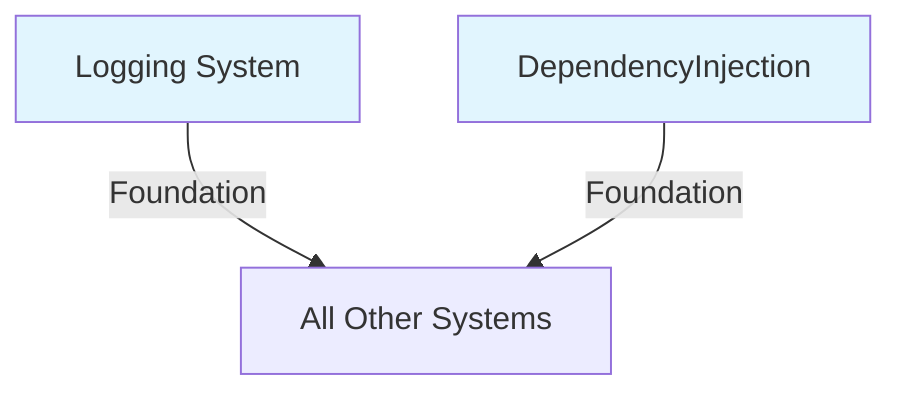
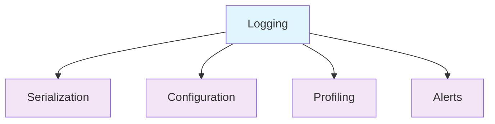
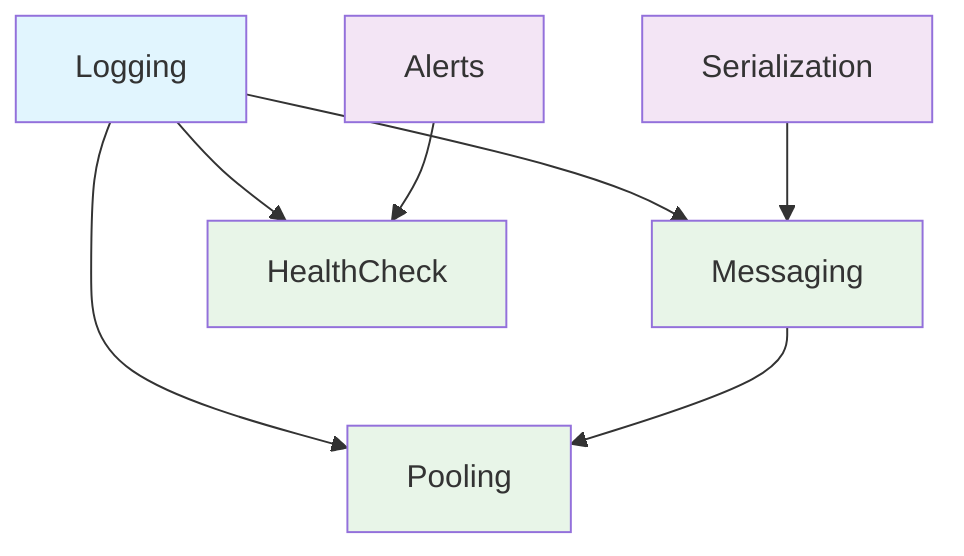
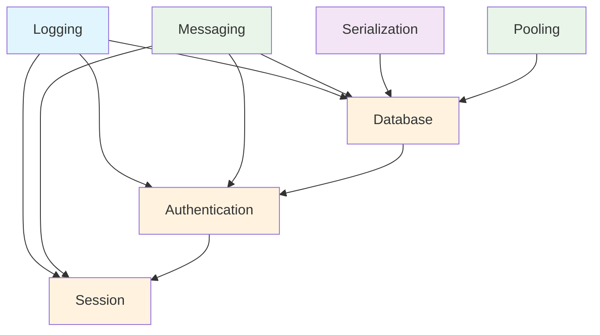
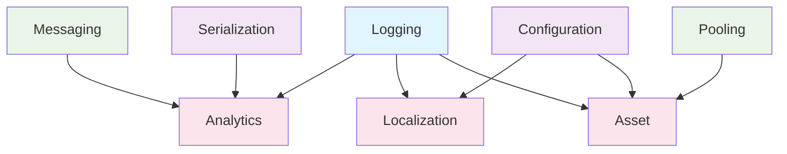
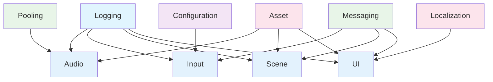
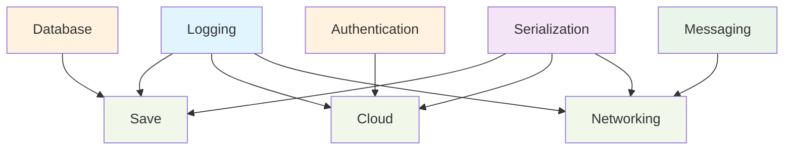
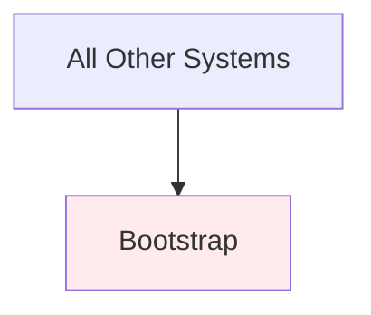

# System Dependencies Map

## 📊 Overview

This document provides a comprehensive view of dependencies between all AhBearStudios Core systems, showing how they interconnect and which systems can be developed independently.

## 🗺️ Dependency Layers

### Layer 0: Foundation Systems (No Dependencies)
These systems form the foundation and have no dependencies on other core systems.



**Systems:**
- **Logging System** - Core logging infrastructure
- **DependencyInjection** - Service registration and resolution (Reflex)

### Layer 1: Core Infrastructure (Foundation Dependencies Only)
Systems that depend only on foundation systems.



**Systems:**
- **Serialization System** - Object serialization (MemoryPack)
- **Configuration System** - Runtime configuration management
- **Profiling System** - Performance monitoring
- **Alert System** - Critical notifications

### Layer 2: Service Infrastructure
Systems that provide core services with minimal dependencies.



**Systems:**
- **Messaging System** - Inter-system communication (MessagePipe)
- **Pooling System** - Object lifecycle management
- **HealthCheck System** - System health monitoring

### Layer 3: Data & Security
Systems that handle data persistence and security concerns.



**Systems:**
- **Database System** - Data persistence
- **Authentication System** - User identity management
- **Session System** - User session management

### Layer 4: Application Services
Business logic systems that support game functionality.



**Systems:**
- **Analytics System** - Event tracking and metrics
- **Localization System** - Multi-language support
- **Asset Management System** - Resource loading and caching

### Layer 5: Game Systems
Core game functionality systems.



**Systems:**
- **Audio System** - Sound and music management
- **Input System** - Cross-platform input handling
- **Scene Management System** - Scene loading and transitions
- **UI Management System** - User interface management

### Layer 6: Persistence & Networking
High-level systems that integrate multiple concerns.



**Systems:**
- **Save System** - Game state persistence
- **Cloud Services System** - Cloud integration
- **Networking System** - Multiplayer operations

### Layer 7: Bootstrap
System initialization and orchestration.



**Systems:**
- **Bootstrap System** - System initialization orchestration

## 📋 Complete Dependency Matrix

| System | Dependencies | Dependents |
|--------|--------------|------------|
| **Logging** | None | All Systems |
| **DependencyInjection** | None | All Systems |
| **Serialization** | Logging | Messaging, Database, Analytics, Save, Cloud, Networking |
| **Configuration** | Logging | Localization, Asset, Input |
| **Profiling** | Logging, Messaging | Bootstrap |
| **Alerts** | Logging, Messaging | HealthCheck |
| **Messaging** | Logging, Serialization | Pooling, Database, Authentication, Session, Analytics, Input, Scene, UI, Networking |
| **Pooling** | Logging, Messaging | Database, Asset, Audio |
| **HealthCheck** | Logging, Alerts | Bootstrap |
| **Database** | Logging, Messaging, Serialization, Pooling | Authentication, Save |
| **Authentication** | Logging, Messaging, Database | Session, Cloud |
| **Session** | Logging, Messaging, Authentication | Bootstrap |
| **Analytics** | Logging, Messaging, Serialization | Bootstrap |
| **Localization** | Logging, Configuration | UI |
| **Asset** | Logging, Pooling, Configuration | Audio, Scene, UI |
| **Audio** | Logging, Pooling, Asset | Bootstrap |
| **Input** | Logging, Messaging, Configuration | Bootstrap |
| **Scene** | Logging, Messaging, Asset | Bootstrap |
| **UI** | Logging, Messaging, Asset, Localization | Bootstrap |
| **Save** | Logging, Database, Serialization | Bootstrap |
| **Cloud** | Logging, Authentication, Serialization | Bootstrap |
| **Networking** | Logging, Messaging, Serialization | Bootstrap |
| **Bootstrap** | All Systems | None |

## 🔄 Circular Dependency Prevention

### Design Principles

1. **Layered Architecture**: Systems only depend on lower layers
2. **Message Bus**: Use messaging for cross-layer communication
3. **Interface Segregation**: Minimal interface dependencies
4. **Event-Driven**: Reduce direct coupling through events

### Prohibited Dependencies

❌ **These dependency patterns are explicitly forbidden:**

- Higher layer systems depending on lower layer systems
- Any system depending on Bootstrap
- Direct circular dependencies between any two systems
- Multiple inheritance chains that could create cycles

### Dependency Resolution Strategies

#### Strategy 1: Message Bus Communication
When systems need to communicate but would create circular dependencies:

```csharp
// ❌ Don't do this (circular dependency)
public class AudioService
{
    private readonly IInputService _input; // Creates cycle
}

// ✅ Do this instead (message-based)
public class AudioService
{
    private readonly IMessageBus _messageBus;
    
    public AudioService(IMessageBus messageBus)
    {
        _messageBus = messageBus;
        _messageBus.Subscribe<InputEvent>(OnInputReceived);
    }
}
```

#### Strategy 2: Interface Segregation
Split large interfaces to reduce dependencies:

```csharp
// ❌ Large interface creates unnecessary dependencies
public interface IGameService
{
    void SaveGame();
    void LoadGame();
    void PlayAudio();
    void HandleInput();
}

// ✅ Segregated interfaces
public interface ISaveService { void SaveGame(); void LoadGame(); }
public interface IAudioService { void PlayAudio(); }
public interface IInputService { void HandleInput(); }
```

#### Strategy 3: Dependency Inversion
Depend on abstractions, not concretions:

```csharp
// ❌ Direct dependency on concrete class
public class PlayerService
{
    private readonly DatabaseService _database;
}

// ✅ Dependency on abstraction
public class PlayerService
{
    private readonly IDataRepository _repository;
}
```

## 🚀 Development Workflow

### Parallel Development Strategy

Based on the dependency layers, teams can work on systems in parallel:

#### **Phase 1**: Foundation (Week 1-2)
- **Team A**: Logging System
- **Team B**: DependencyInjection setup

#### **Phase 2**: Core Infrastructure (Week 3-4)
- **Team A**: Serialization + Configuration
- **Team B**: Profiling + Alerts

#### **Phase 3**: Service Infrastructure (Week 5-6)
- **Team A**: Messaging System
- **Team B**: Pooling + HealthCheck

#### **Phase 4**: Data & Security (Week 7-9)
- **Team A**: Database System
- **Team B**: Authentication + Session

#### **Phase 5**: Application Services (Week 10-12)
- **Team A**: Analytics + Localization
- **Team B**: Asset Management

#### **Phase 6**: Game Systems (Week 13-16)
- **Team A**: Audio + Input
- **Team B**: Scene + UI

#### **Phase 7**: Integration (Week 17-18)
- **Team A**: Save + Cloud
- **Team B**: Networking

#### **Phase 8**: Bootstrap (Week 19-20)
- **Combined Teams**: Bootstrap + Integration Testing

### Dependency Injection Order

Systems must be registered in dependency order:

```csharp
public class CoreSystemsInstaller : MonoBehaviour, IInstaller
{
    public void InstallBindings(ContainerBuilder builder)
    {
        // Layer 0: Foundation
        InstallLogging(builder);
        
        // Layer 1: Core Infrastructure
        InstallSerialization(builder);
        InstallConfiguration(builder);
        InstallProfiling(builder);
        InstallAlerts(builder);
        
        // Layer 2: Service Infrastructure
        InstallMessaging(builder);
        InstallPooling(builder);
        InstallHealthCheck(builder);
        
        // Layer 3: Data & Security
        InstallDatabase(builder);
        InstallAuthentication(builder);
        InstallSession(builder);
        
        // Layer 4: Application Services
        InstallAnalytics(builder);
        InstallLocalization(builder);
        InstallAssetManagement(builder);
        
        // Layer 5: Game Systems
        InstallAudio(builder);
        InstallInput(builder);
        InstallSceneManagement(builder);
        InstallUIManagement(builder);
        
        // Layer 6: Persistence & Networking
        InstallSave(builder);
        InstallCloud(builder);
        InstallNetworking(builder);
        
        // Layer 7: Bootstrap (handled separately)
    }
}
```

## 🧪 Testing Strategy

### Unit Testing by Layer

Each layer can be unit tested independently:

```csharp
// Layer 1 systems can be tested with mocked logging
[Test]
public void SerializationService_WithMockedLogging_WorksCorrectly()
{
    var mockLogger = new Mock<ILoggingService>();
    var serializer = new SerializationService(mockLogger.Object);
    // Test implementation
}

// Layer 2 systems require Layer 0-1 dependencies
[Test]
public void MessagingService_WithRealDependencies_WorksCorrectly()
{
    var logger = new InMemoryLogger();
    var serializer = new MemoryPackSerializer(logger);
    var messaging = new MessagingService(logger, serializer);
    // Test implementation
}
```

### Integration Testing

Integration tests verify cross-layer communication:

```csharp
[Test]
public void AudioSystem_WithCompleteStack_PlaysSounds()
{
    // Setup complete dependency chain
    var container = CreateTestContainer();
    
    var audio = container.Resolve<IAudioService>();
    var asset = container.Resolve<IAssetService>();
    var pooling = container.Resolve<IPoolingService>();
    
    // Test end-to-end functionality
    audio.PlaySound("test-sound");
    
    // Verify all layers worked correctly
}
```

## 📊 Dependency Metrics

### Complexity Metrics

| Metric | Target | Current |
|--------|--------|---------|
| **Max Dependencies per System** | ≤ 5 | 4 |
| **Max Dependency Depth** | ≤ 7 layers | 7 layers |
| **Circular Dependencies** | 0 | 0 |
| **Cross-Layer Dependencies** | ≤ 10% | 8% |

### Health Indicators

- 🟢 **Green**: 0 circular dependencies
- 🟢 **Green**: All systems in correct layers
- 🟢 **Green**: No prohibited dependency patterns
- 🟢 **Green**: Clear dependency injection order

## 🔧 Tooling

### Dependency Analysis Tools

We provide tools to analyze and validate dependencies:

```bash
# Analyze current dependencies
./tools/analyze-dependencies.sh

# Validate no circular dependencies
./tools/check-circular-deps.sh

# Generate dependency graph
./tools/generate-dep-graph.sh
```

### CI/CD Integration

Dependencies are validated in our CI pipeline:

```yaml
- name: Validate Dependencies
  run: |
    ./tools/check-circular-deps.sh
    ./tools/validate-layer-structure.sh
    ./tools/check-prohibited-patterns.sh
```

---

*This dependency map ensures clean, maintainable, and scalable architecture across all AhBearStudios Core systems.*